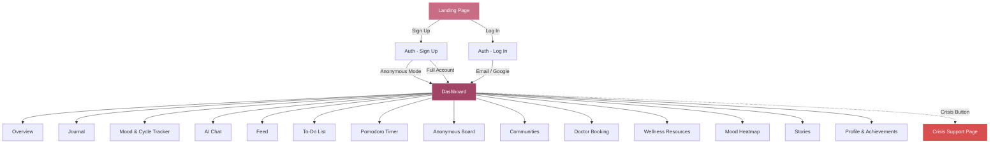
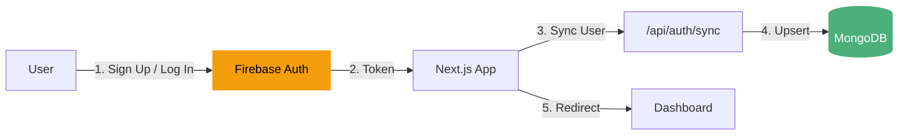
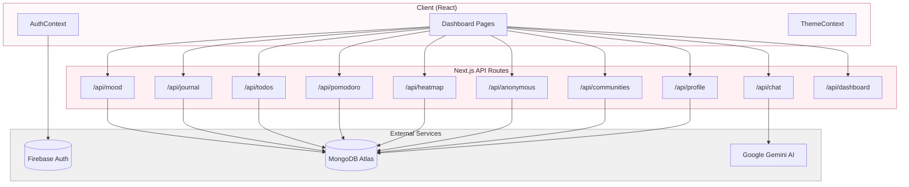
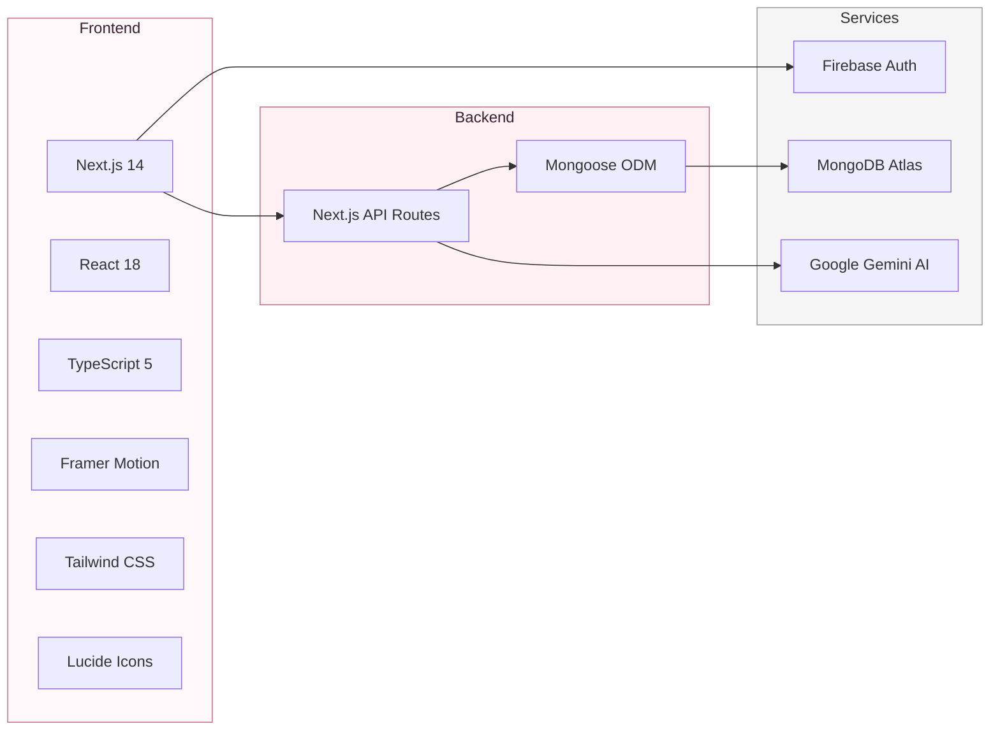

<div align="center">

# Solace

### A Safe Space for Mental Wellness

*Track your mood, journal your thoughts, focus with timers, connect with communities, and take care of your well-being — all in one place, completely private.*

[](https://nextjs.org/)
[](https://firebase.google.com/)
[](https://www.mongodb.com/atlas)
[](https://www.typescriptlang.org/)

</div>

---

## Table of Contents

- [Overview](#overview)
- [Application Flow](#application-flow)
- [Features](#features)
- [Unique Highlights](#unique-highlights)
- [Tech Stack](#tech-stack)
- [Architecture](#architecture)
- [Setup & Installation](#setup--installation)
- [Environment Variables](#environment-variables)
- [Project Structure](#project-structure)

---

## Overview

Solace is a comprehensive mental wellness platform designed with empathy and privacy at its core. It offers mood tracking, journaling with sentiment analysis, an AI chatbot for mental health support, focus timers with music, anonymous support boards, community groups, crisis resources, and a gamified profile system — all wrapped in a clean, calming UI with smooth animations.

---

## Application Flow



### User Authentication Flow



### Data Flow



---

## Features

| Feature | Description |
|---|---|
| **Landing Page** | Dark pink gradient with animated intro, Sign Up / Log In buttons |
| **Authentication** | Email/password, Google sign-in, and anonymous mode via Firebase |
| **Dashboard Overview** | Greeting, quick stats (mood streak, journal entries, tasks done, focus time), daily challenges |
| **Journal** | Write entries with mood tags; automatic sentiment analysis (Very Positive → Negative) |
| **Mood & Cycle Tracker** | 12 moods, period tracking with flow intensity, symptom logging, cycle prediction, calendar view |
| **AI Chat** | Mental health chatbot with quick prompts ("I'm feeling anxious", "Help me calm down") powered by Gemini |
| **Feed** | Curated wellness content — articles, breathing exercises, quizzes, guided meditations |
| **To-Do List** | Add tasks with priority (High/Med/Low), checkbox animations, batch adding, filter tabs |
| **Pomodoro Timer** | 4 presets + custom timer, 8 activity categories, embedded YouTube study music player |
| **Anonymous Board** | Post anonymously with tags (courage, healing, resilience); react with hearts and hugs |
| **Communities** | Join groups (Study Buddies, Anxiety Support, Mindful Women, etc.) across 6 categories |
| **Doctor Booking** | Browse mental health professionals with specialty, rating, pricing, and time slots |
| **Wellness Resources** | Yoga routines, self-help book recommendations, breathing & grounding exercises |
| **Mood Heatmap** | GitHub-style yearly grid — each mood has its own color, hover tooltips, streak tracking |
| **Stories** | Inspirational recovery stories, empowerment quotes, women-in-STEM highlights |
| **Profile** | Gamification with XP, levels (Newcomer → Enlightened Soul), and 12 achievement badges |
| **Crisis Support** | Emergency hotlines (India), guided breathing exercise, 5-4-3-2-1 grounding technique |

---

## Unique Highlights

- **Privacy-First Design** — Anonymous mode lets users access the full platform without sharing any personal information
- **Menstrual Cycle Intelligence** — Auto-marks 5-day periods, predicts next cycle from just one logged entry (defaults to 28-day cycle)
- **GitHub-Style Mood Heatmap** — Full calendar year visualization where each mood gets its own unique color on the grid
- **Integrated Study Music** — YouTube player embedded directly in the Pomodoro timer with 8 curated recommendation
- **Gamified Wellness** — XP system that rewards journaling, mood logging, completing tasks, and focus sessions with levels and badges
- **AI-Powered Journaling** — Automatic sentiment analysis on every journal entry
- **Crisis Always Accessible** — Floating red crisis button visible on every dashboard page, no auth required for the crisis page
- **Warm UI Language** — Calming pink/mauve theme with Outfit font, smooth Framer Motion animations, and no harsh colors

---

## Tech Stack



| Layer | Technology |
|---|---|
| Framework | Next.js 14.2.5 (App Router) |
| Language | TypeScript 5 |
| UI | React 18, Tailwind CSS, Framer Motion |
| Icons | Lucide React |
| Auth | Firebase Authentication (Email, Google, Anonymous) |
| Database | MongoDB Atlas via Mongoose 9 |
| AI | Google Gemini API |
| Font | Outfit (Google Fonts) |
| Utilities | clsx, tailwind-merge |

---

## Architecture

```mermaid
flowchart TB
    subgraph Browser
        LP[Landing Page<br/>"app/page.tsx"]
        AUTH[Auth Page<br/>"app/auth/page.tsx"]
        DASH[Dashboard Layout<br/>"app/dashboard/layout.tsx"]
        PAGES["15 Feature Pages<br/>Journal, Mood, Chat, etc."]
        CTX["Contexts<br/>AuthContext + ThemeContext"]
    end

    subgraph "Next.js Server"
        ROUTES["11 API Routes<br/>/api/mood, /api/journal, etc."]
        MODELS["8 Mongoose Models<br/>User, MoodLog, Todo, etc."]
    end

    subgraph "Cloud Services"
        FB["Firebase<br/>Auth + Analytics"]
        MONGO["MongoDB Atlas<br/>Primary Database"]
        GEM["Google Gemini<br/>AI Chatbot"]
    end

    LP --> AUTH --> DASH --> PAGES
    CTX --> DASH
    PAGES -->|fetch| ROUTES
    ROUTES --> MODELS --> MONGO
    ROUTES -->|chat| GEM
    CTX -->|auth| FB

    style Browser fill:#fef8fa,stroke:#c76d85
    style MONGO fill:#4caf7c,color:#fff,stroke:none
    style FB fill:#f59e0b,color:#000,stroke:none
    style GEM fill:#4285f4,color:#fff,stroke:none
```

---

## Setup & Installation

### Prerequisites

- **Node.js** 18+ and **npm** (or yarn/pnpm)
- A **MongoDB Atlas** cluster (free tier works)
- A **Firebase** project with Authentication enabled
- A **Google Gemini API** key (for the AI chatbot)

### 1. Clone the Repository

```bash
git clone https://github.com/sanhithaac/Solace.git
cd Solace
```

### 2. Install Dependencies

```bash
npm install
```

### 3. Set Up Environment Variables

Create a `.env.local` file in the project root:

```env
# MongoDB
MONGODB_URI=mongodb+srv://<username>:<password>@<cluster>.mongodb.net/solace?retryWrites=true&w=majority

# Firebase
NEXT_PUBLIC_FIREBASE_API_KEY=your_firebase_api_key
NEXT_PUBLIC_FIREBASE_AUTH_DOMAIN=your_project.firebaseapp.com
NEXT_PUBLIC_FIREBASE_PROJECT_ID=your_project_id
NEXT_PUBLIC_FIREBASE_STORAGE_BUCKET=your_project.appspot.com
NEXT_PUBLIC_FIREBASE_MESSAGING_SENDER_ID=your_sender_id
NEXT_PUBLIC_FIREBASE_APP_ID=your_app_id
NEXT_PUBLIC_FIREBASE_MEASUREMENT_ID=G-your_measurement_id

# Google Gemini AI (for chatbot)
GEMINI_API_KEY=your_gemini_api_key
```

### 4. Configure Firebase

1. Go to [Firebase Console](https://console.firebase.google.com/) → Create a new project
2. Enable **Authentication** → Sign-in methods: **Email/Password**, **Google**, **Anonymous**
3. Copy the Firebase config values into `.env.local`

### 5. Configure MongoDB

1. Go to [MongoDB Atlas](https://www.mongodb.com/atlas) → Create a free cluster
2. Create a database user and whitelist your IP (or use `0.0.0.0/0` for development)
3. Get the connection string and paste it as `MONGODB_URI`

### 6. Get Gemini API Key

1. Go to [Google AI Studio](https://aistudio.google.com/app/apikey)
2. Create an API key and paste it as `GEMINI_API_KEY`

### 7. Run the Development Server

```bash
npm run dev
```

Open [http://localhost:3000](http://localhost:3000) to see Solace.

### 8. Build for Production

```bash
npm run build
npm start
```

---

## Project Structure

```
solace/
├── app/
│   ├── page.tsx                 # Landing page (dark pink gradient)
│   ├── layout.tsx               # Root layout (Outfit font, AuthProvider)
│   ├── globals.css              # Global styles
│   ├── auth/page.tsx            # Login / Sign Up page
│   ├── crisis/page.tsx          # Crisis support (no auth required)
│   ├── dashboard/
│   │   ├── layout.tsx           # Sidebar navigation + Crisis button
│   │   ├── page.tsx             # Dashboard overview
│   │   ├── journal/page.tsx     # Journal with sentiment analysis
│   │   ├── mood/page.tsx        # Mood & menstrual cycle tracker
│   │   ├── chat/page.tsx        # AI chatbot (Gemini)
│   │   ├── feed/page.tsx        # Wellness content feed
│   │   ├── todos/page.tsx       # To-Do list with priorities
│   │   ├── pomodoro/page.tsx    # Focus timer + YouTube music
│   │   ├── anonymous/page.tsx   # Anonymous support board
│   │   ├── communities/page.tsx # Community groups
│   │   ├── doctors/page.tsx     # Doctor booking directory
│   │   ├── wellness/page.tsx    # Yoga, books, exercises
│   │   ├── heatmap/page.tsx     # GitHub-style mood heatmap
│   │   ├── stories/page.tsx     # Inspirational stories
│   │   └── profile/page.tsx     # Profile, XP, achievements
│   └── api/
│       ├── auth/sync/route.ts   # Sync Firebase user → MongoDB
│       ├── mood/route.ts        # CRUD mood logs
│       ├── journal/route.ts     # CRUD journal entries
│       ├── todos/route.ts       # CRUD tasks
│       ├── pomodoro/route.ts    # Save focus sessions
│       ├── chat/route.ts        # AI chat (Gemini)
│       ├── heatmap/route.ts     # Yearly mood data
│       ├── anonymous/route.ts   # Anonymous posts
│       ├── communities/route.ts # Community groups
│       ├── profile/route.ts     # User profile + XP
│       └── dashboard/route.ts   # Aggregated stats
├── context/
│   ├── AuthContext.tsx           # Firebase auth + MongoDB sync
│   └── ThemeContext.tsx          # Theme tokens (pink/mauve palette)
├── lib/
│   ├── firebase.ts              # Firebase initialization
│   └── mongodb.ts               # Mongoose connection
├── models/
│   ├── User.ts                  # User schema (XP, level)
│   ├── MoodLog.ts               # Mood + period + symptoms
│   ├── JournalEntry.ts          # Journal entries
│   ├── Todo.ts                  # Tasks with priority
│   ├── PomodoroSession.ts       # Focus sessions
│   ├── AnonymousPost.ts         # Anonymous board posts
│   ├── Community.ts             # Community groups
│   └── Conversation.ts          # AI chat history
├── .env.local                   # Environment variables (not committed)
├── next.config.mjs
├── tailwind.config.ts
├── tsconfig.json
└── package.json
```

---

<div align="center">

*Built with care for the ACM Hackathon*

**Your data is private. Your space is safe.**

</div>
